<p align="center">
  
</p>

<p align="center">
  <a href="https://nextjs.org"></a>
  <a href="https://socket.io"></a>
  <a href="https://render.com"></a>
  <a href="https://vercel.com"></a>
</p>

<p align="center">
  Versión online de <strong>La Campaña</strong> con salas multijugador, motor de reglas propio,
  reconexión por <code>playerId</code> y una mesa táctica pensada para jugar desde navegador.
</p>

## Qué incluye

- motor de reglas en `motor/` alineado al reglamento del juego
- salas multijugador con sincronización en tiempo real por Socket.io
- cliente en `Next.js 14` con tablero, lobby, sala y drag and drop
- servidor autoritativo para reglas, turnos, visibilidad y reconexión
- arquitectura preparada para `frontend en Vercel + backend en Render`

## Stack

- `Next.js 14`
- `React 18`
- `Socket.io`
- `TypeScript`
- `Tailwind CSS`
- `Framer Motion`
- `Zustand`

## Estructura

```text
app/              rutas y pantallas
componentes/      cartas, tablero, HUD y piezas UI
ganchos/          socket y estado derivado del cliente
lib/              cliente Socket.io y utilidades
motor/            lógica pura del juego
servidor/         salas, sockets y bootstrap de backend
tienda/           store Zustand
render.yaml       blueprint para Render
```

## Desarrollo local

```bash
npm install
npm run dev
```

Abrí:

- `http://localhost:3000`
- `http://localhost:3000/vestibulo`

## Variables de entorno

Usá `.env.example` como base.

```bash
NEXT_PUBLIC_SOCKET_URL=https://lacampaniaonline.onrender.com
CORS_ALLOWED_ORIGINS=https://la-campania.vercel.app,http://localhost:3000
```

## Deploy recomendado

### Frontend en Vercel

1. Importá este repo en Vercel.
2. Configurá la variable:

```bash
NEXT_PUBLIC_SOCKET_URL=https://lacampaniaonline.onrender.com
```

3. Deploy.

### Backend en Render

Este repo ya incluye [`render.yaml`](./render.yaml) para el backend realtime.

1. Subí el repo a GitHub.
2. En Render, creá un Blueprint desde este repo.
3. Configurá la variable:

```bash
CORS_ALLOWED_ORIGINS=https://la-campania.vercel.app,http://localhost:3000
```

4. Aplicá el Blueprint.

Valores actuales del proyecto:

- frontend: `https://la-campania.vercel.app/`
- backend: `https://lacampaniaonline.onrender.com/`

El backend expone:

- `/health`
- Socket.io en el mismo dominio del servicio

## Scripts

```bash
npm run dev
npm run build
npm run build:backend
npm run start
npm run start:backend
npm run test
```

## Estado actual

- salas, lobby y reconexión
- modo individual y alianzas
- despliegue inicial de guerreros
- combate, sabotaje, comercio y castillo
- cierre de sala por anfitrión
- base visual medieval con tablero táctico

## Verificación

```bash
npm run build
npm run test
```

## Próximo paso natural

- conectar assets reales desde la carpeta `cartas`
- terminar de pulir flujos contextuales por fase
- ajustar la presentación visual para 3 a 5 jugadores completos
